# Tiremo - IoT Cybersecurity (CRA) - Accelerator Workshop Kurulum Rehberi
> Accelerator Workshop - Tiremo IoT Cybersecurity & Cyber Resilience Act

Bu doküman, Tiremo - IoT Cybersecurity (CRA) - Accelerator workshop kapsamında kullanılacak ESP32 geliştirme ortamının Windows, macOS ve Linux işletim sistemleri için nasıl kurulacağını adım adım açıklamaktadır.

## 📋 İçindekiler

- [Sistem Gereksinimleri](#-sistem-gereksinimleri)
- [VSCode ve Eklentilerin Kurulumu](#vscode-ve-eklentilerin-kurulumu)
- [Alternatif Kurulum Yöntemleri](#alternatif-kurulum-yöntemleri)
  - [Windows Kurulumu](#1-windows-kurulumu)
  - [macOS / Linux Kurulumu](#2-macos--linux-kurulumu)
- [Kurulum Doğrulama](#kurulum-doğrulama)
- [Faydalı Komutlar](#faydalı-komutlar)
- [Kaynaklar](#-kaynaklar)

## 💻 Sistem Gereksinimleri

### Windows
- Windows 10 veya daha yeni
- Minimum 4 GB RAM (8 GB önerilir)
- En az 10 GB boş disk alanı
- Internet bağlantısı

### macOS
- macOS 10.15 (Catalina) veya daha yeni
- Homebrew paket yöneticisi
- Xcode Command Line Tools
- Minimum 4 GB RAM (8 GB önerilir)
- En az 10 GB boş disk alanı

### Linux
- Ubuntu 20.04 LTS veya daha yeni (Debian tabanlı dağıtımlar)
- Minimum 4 GB RAM (8 GB önerilir)
- En az 10 GB boş disk alanı
- sudo yetkisi

## VSCode ve Eklentilerin Kurulumu

### VSCode Kurulumu

Visual Studio Code, ESP32 geliştirme için önerilen kod editörüdür. İşletim sisteminize uygun versiyonu indirmek için:

🔗 **İndirme Linki:** [https://code.visualstudio.com/download](https://code.visualstudio.com/download)

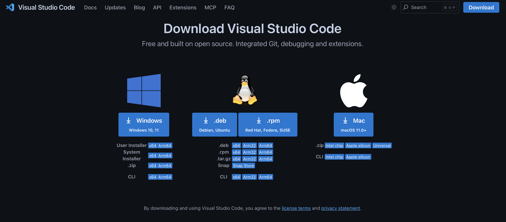

**İşletim Sistemine Göre Kurulum:**
- **Windows:** `.exe` dosyasını indirip çalıştırın
- **macOS:** `.dmg` dosyasını indirip Applications klasörüne sürükleyin
- **Linux:** `.deb` (Debian/Ubuntu) veya `.rpm` (Fedora/RHEL) paketini kullanın

### ESP-IDF Extension Kurulumu

VS Code kurduktan sonra ESP-IDF extension'ını yüklemeniz gerekmektedir:

1. VS Code'u açın
2. Sol taraftaki Extensions simgesine tıklayın (veya `Ctrl+Shift+X` / `Cmd+Shift+X`)
3. Arama kutusuna **"ESP-IDF"** yazın
4. **Espressif IDF** extension'ını bulun ve **Install** butonuna tıklayın

🔗 **Extension Linki:** [ESP-IDF Extension](https://marketplace.visualstudio.com/items?itemName=espressif.esp-idf-extension)

> **İpucu:** Extension yüklendikten sonra, ESP-IDF'yi otomatik olarak kurabilir veya mevcut kurulumunuzu kullanabilirsiniz.

### ESP-IDF Extension ile IDF Kurulumu

Extension kurulduktan sonra ESP-IDF'yi yapılandırmanız gerekmektedir:

**Yöntem 1: Otomatik Yönlendirme**
- Extension kurulumu tamamlandıktan sonra VS Code sizi otomatik olarak kurulum sayfasına yönlendirecektir.

**Yöntem 2: Manuel Açma**
- Eğer otomatik yönlendirme olmadıysa:
  1. `Ctrl+Shift+P` (Windows/Linux) veya `Cmd+Shift+P` (macOS) tuşlarına basın
  2. Komut paletine aşağıdaki komutu yazın:
     ```
     >ESP-IDF: Configure ESP-IDF Extension
     ```
  3. Enter'a basarak kurulum sayfasını açın

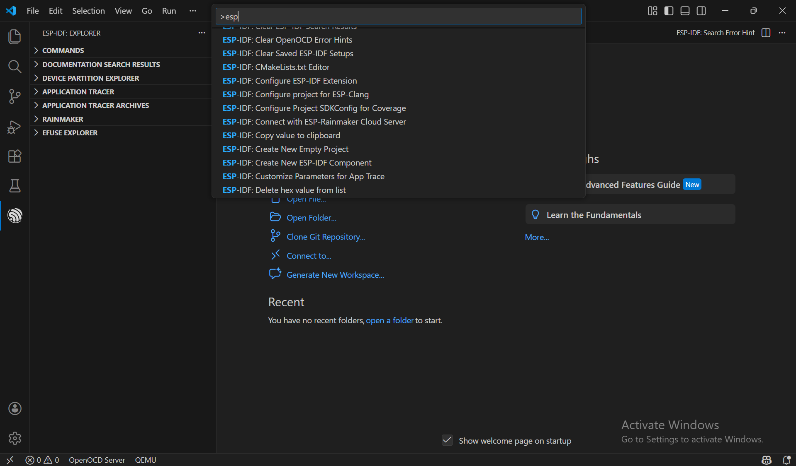

**Kurulum Seçenekleri:**

- **Express:** Hızlı kurulum
- **Advanced:** Özelleştirilmiş kurulum (mevcut kurulumu kullanma veya farklı versiyon seçme)

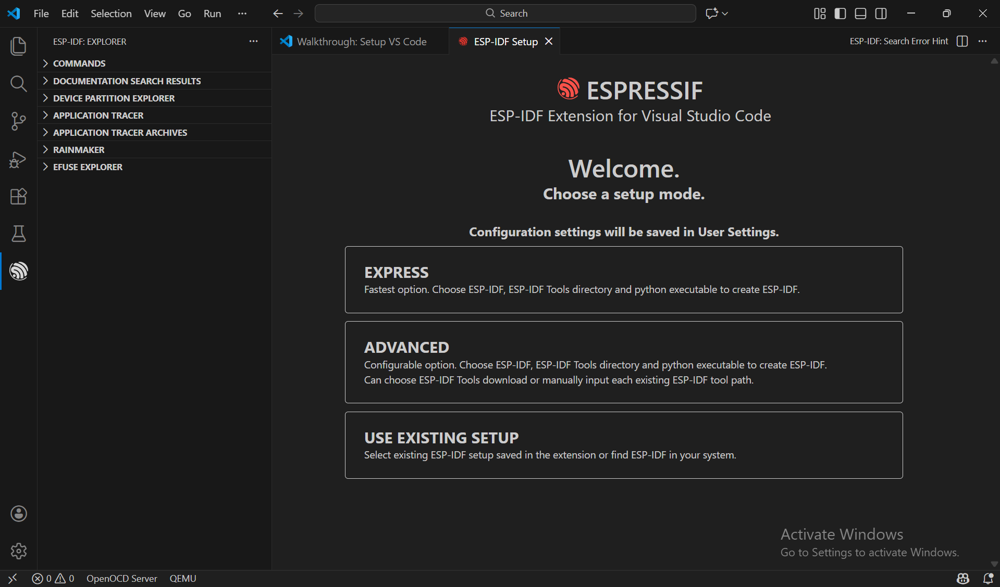
> **Not:** Express kurulum seçeneği, yeni başlayanlar için en kolay yöntemdir.

#### Workshop için Kurulum Ayarları

Bu workshop kapsamında aşağıdaki ayarları kullanacağız:

1. **Kurulum Yöntemi:** Express
2. **ESP-IDF Versiyonu:** v5.3


> ⚠️ **Önemli:** ESP-IDF'yi kurulum yaparken, kurulum yolunda **Türkçe karakter** (ü, ö, ş, ı, ğ, ç) içermeyen bir dizin seçiniz. Örnek: `C:\esp` veya `C:\Users\YourName\esp`

**Kurulum Adımları:**

1. Yukarıdaki ekranda ESP-IDF versiyonu olarak **v5.3** seçili olduğundan emin olun
2. **Install** Butonnuna tıklayın
3. Kurulum işlemi başlayacak ve birkaç dakika sürebilir
4. Kurulum tamamlandığında extension kullanıma hazır olacaktır

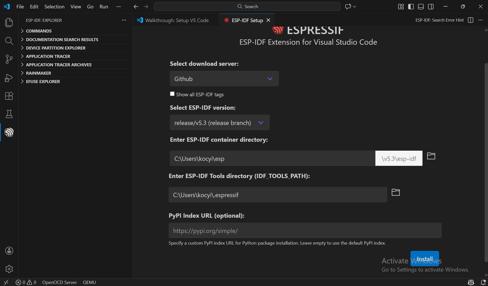

> **İpucu:** Kurulum sırasında gerekli araçlar ve kütüphaneler otomatik olarak indirilecektir. İnternet bağlantınızın stabil olduğundan emin olun.

## Alternatif Kurulum Yöntemleri
### 1. Windows Kurulumu

- https://dl.espressif.com/dl/esp-idf/ adresinden **Universal Online Installer 2.4.0** indirilir.

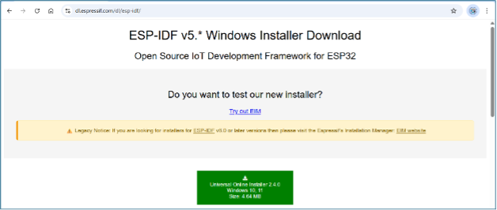

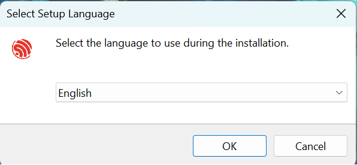

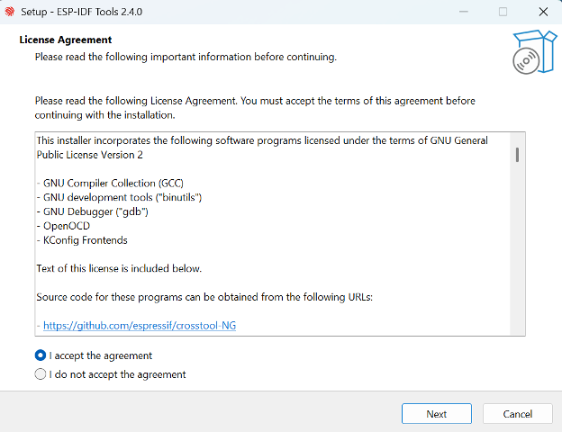

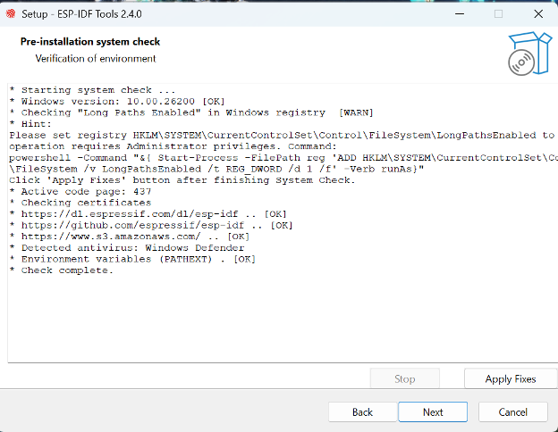

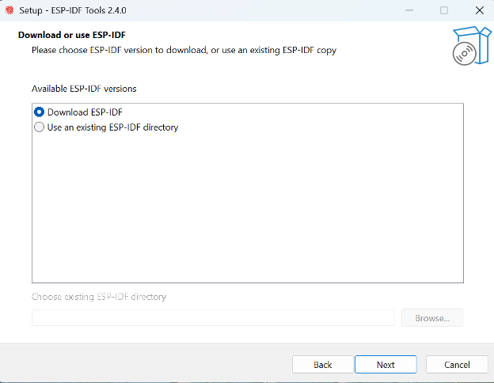


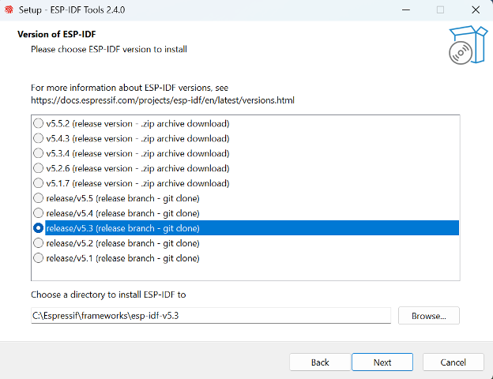

- IDF versiyonu **v5.3** olarak seçilmelidir.

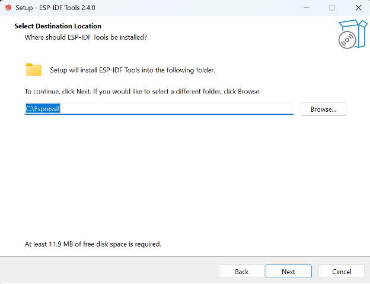

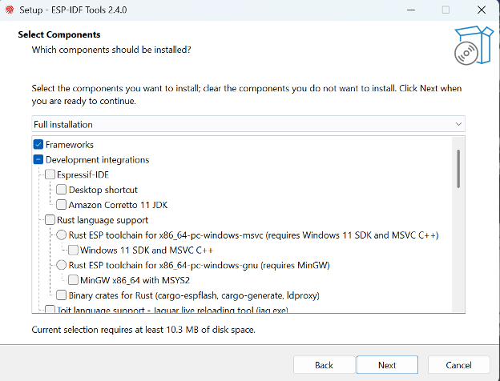

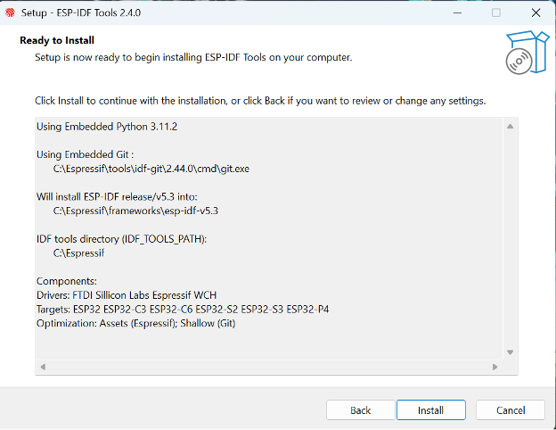

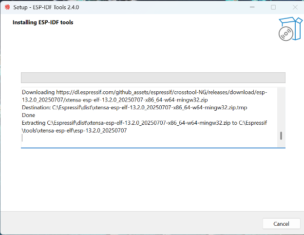

- Bu aşama biraz vakit alabilir, gerekli ESP kütüphaneleri indiriliyor.

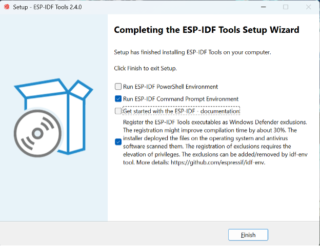

- İşlem tamamlandıktan sonra ESP projeleri için kullanabileceğiniz terminal açılacaktır. İlerleyen günlerde sizlerle çalışacağımız proje dosyasını paylaşacağız. Bu terminalde örnek proje klasörünün içine girerek `idf.py build` komutunu çalıştırıp kodu derleyebilirsiniz.

### 2. macOS / Linux Kurulumu

#### Aşama 1 – Gerekli Paketlerin Kurulumu

**Linux Kullanıcıları için:**
```bash
sudo apt-get install git wget flex bison gperf python3 python3-pip python3-venv cmake ninja-build ccache libffi-dev libssl-dev dfu-util libusb-1.0-0
```

**macOS Kullanıcıları için:**
```bash
brew install cmake ninja dfu-util
```

#### Aşama 2 – Python 3 Kontrolü

Python sürümünü kontrol ediniz:
```bash
python --version
```

Python 3.x yüklü olmalıdır.

Eğer Python yüklü değilse (macOS):
```bash
brew install python3
```

#### Aşama 3 – ESP-IDF İndirme

```bash
mkdir -p ~/esp
cd ~/esp
git clone -b v5.3 --recursive https://github.com/espressif/esp-idf.git
```

📦 **ESP-IDF Repository:** [https://github.com/espressif/esp-idf.git](https://github.com/espressif/esp-idf.git)

#### Aşama 4 – Gerekli Araçların Kurulumu

```bash
cd ~/esp/esp-idf
./install.sh esp32
```

Bu adımda derleyici, debugger ve gerekli Python paketleri kurulacaktır.

#### Aşama 5 – Ortam Değişkenlerinin Ayarlanması

ESP-IDF araçlarının terminalden kullanılabilmesi için aşağıdaki komut çalıştırılmalıdır:

```bash
. $HOME/esp/esp-idf/export.sh
```

Artık proje klasörü içerisine girerek aşağıdaki komut çalıştırılabilir:

```bash
idf.py build
```

Bu komutun hatasız tamamlanması, kurulumun başarılı olduğunu gösterir.

> **Not:** Proje dosyası ilerleyen günlerde sizlerle paylaşılacaktır, bunun akabinde terminalde ESP ortamı ayarlandıktan sonra `idf.py build` komutu ile projeyi derleyebilirsiniz.

---

## Kurulum Doğrulama

Kurulumun başarılı olduğundan emin olmak için aşağıdaki komutları çalıştırın:

### ESP-IDF Versiyonunu Kontrol Etme
```bash
idf.py --version
```
Çıktıda `v5.3` görmelisiniz.

### Python Versiyonunu Kontrol Etme
```bash
python --version
```
Python 3.8 veya daha yeni bir sürüm görmelisiniz.

### Compiler Kontrolü
```bash
xtensa-esp32-elf-gcc --version
```
Bu komut ESP32 için cross-compiler versiyonunu gösterecektir.

---

## Faydalı Komutlar

Geliştirme sürecinde sıkça kullanacağınız komutlar:

### Proje Derleme
```bash
idf.py build
```

### Kod Temizleme
```bash
idf.py fullclean
```

### Seri Port Seçimi
```bash
idf.py -p /dev/ttyUSB0 flash monitor    # Linux
idf.py -p /dev/cu.usbserial-* flash monitor    # macOS
idf.py -p COM3 flash monitor    # Windows
```

### Kodu ESP32'ye Yükleme
```bash
idf.py flash
```

### Seri Monitor Başlatma
```bash
idf.py monitor
```
*Monitörden çıkmak için: `Ctrl + ]`*

### Tek Komutta Derleme, Yükleme ve İzleme
```bash
idf.py build flash monitor
```

### Proje Yapılandırma Menüsü
```bash
idf.py menuconfig
```

---

## 📚 Kaynaklar

### Resmi Dokümantasyon
- [ESP-IDF Programming Guide](https://docs.espressif.com/projects/esp-idf/en/v5.3/esp32/index.html)
- [ESP32 Teknik Referans](https://www.espressif.com/sites/default/files/documentation/esp32_technical_reference_manual_en.pdf)
- [ESP-IDF GitHub Repository](https://github.com/espressif/esp-idf)

### Faydalı Linkler
- [ESP32 Forum](https://esp32.com/)
- [Espressif GitHub Examples](https://github.com/espressif/esp-idf/tree/master/examples)
- [ESP-IDF VS Code Extension](https://marketplace.visualstudio.com/items?itemName=espressif.esp-idf-extension)

### Video Eğitimler
- [Espressif Systems YouTube](https://www.youtube.com/c/EspressifSystems)

---
